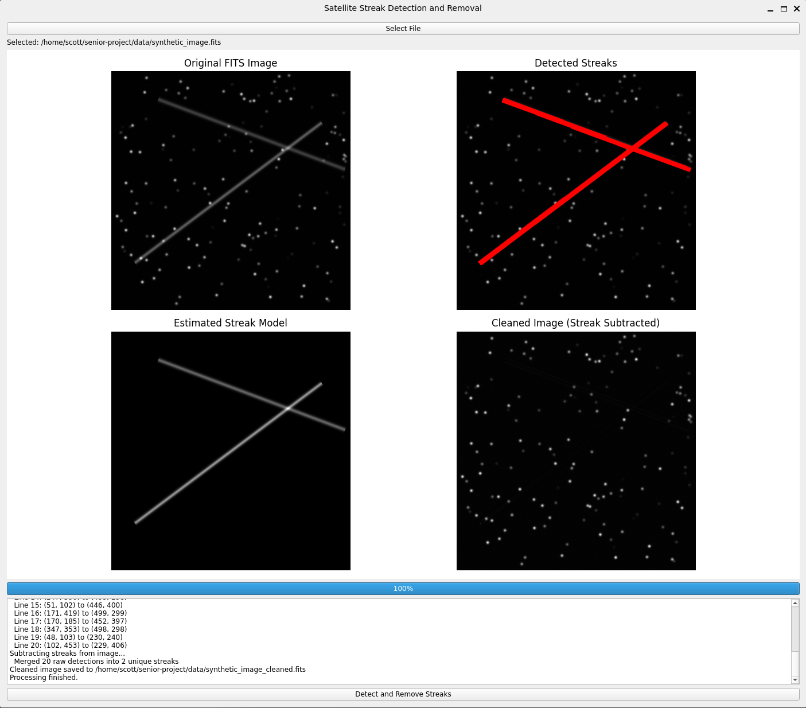

# Detecting and Removing Satellite Streaks
An automated astronomical image processing pipeline designed to detect, model, and subtract satellite streaks while preserving the underlying stellar field.

## Overview
The rapid deployment of Low-Earth Orbit (LEO) satellite "mega-constellations" (e.g., Starlink, OneWeb) is increasingly compromising ground-based astronomical observations. Satellite streaks introduce severe linear artifacts into FITS (Flexible Image Transport System) images, which can mask real celestial objects and mimic false ones.

The Satellite Streak Remover is an automated astronomical image processing pipeline designed to detect, mathematically model, and safely subtract satellite streaks from FITS images while strictly preserving the underlying celestial data (stars, galaxies, and sky background).

## Installation
Clone the repository:

    git clone https://github.com/ScottHakoda/Satellite-Streak-Remover.git
    cd Satellite-Streak-Remover

Install the required dependencies:

    pip install -r requirements.txt

## Usage
The primary way to interact with the streak removal tool is through its PyQt-based GUI, which allows you to load FITS files, visualize the detection, and process the cleanup.
To launch the GUI:

    python detect_streaks.py

- Click Open File and select a .fits image.  
- Click Process/Detect to begin the automated pipeline.  
- The console will output progress, and the viewer will update with the cleaned image.  

To generate your own synthetic FITS images for testing or benchmarking:

    python simulate.py

This will generate two FITS files in the ../data/ directory by default:
- synthetic_image.fits: The image containing noise, stars, and streaks.
- synthetic_image_truth.fits: The absolute ground truth image (noise and stars only).

## Features
- Automated Detection: Utilizes high-percentile thresholding and Probabilistic Hough Transforms to isolate linear anomalies from dense star fields.

- Precise Photometric Modeling: Employs dynamic Moffat profile fitting to accurately model the cross-sectional shape, brightness variations, and sub-pixel trajectory of tumbling or flaring satellites.

- Safe Subtraction: Uses spatial exclusion masks and direct photometric subtraction to remove the artifact without introducing negative trenching or damaging intersecting stars.

- Synthetic Benchmarking: Includes a robust FITS generation module to simulate realistic sky backgrounds, read noise, stellar PSFs, and linear streaks for algorithm validation.  

